Trabajo hecho el 19-11-2024 en la universidad

[GitHub: Ch4mbi](https://github.com/Ch4mbi)

Este es un trabajo que se llevó a cabo como tarea/caso de estudio hace un año. He tapado el usuario por confidencialidad.
Se hizo el trabajo en windows, no en linux, por lo que la "naturaleza" de los comandos cambia.

# Escenario del caso

“Son las 8:30 de la mañana y me dispongo a iniciar sesión en mi equipo de trabajo... Debería  
cambiar de empresa, no me pagan lo suficiente y no hacen más que cargarme con  
responsabilidades que no me corresponden. Pero con todo esto entre manos...  
No puedo irme ahora sin terminar lo empezado.

Voy a revisar los ficheros, todos los días a la misma hora compruebo que ninguno haya sufrido  
ninguna modificación. Nadie debe saber de qué se trata.  
\[...\]  
No está. Alguien ha accedido al ordenador y ha robado aquello que llevábamos tanto tiempo  
manteniendo en secreto. Si sale a la luz...  
Por favor, necesito tu ayuda. Tenemos que saber quién ha sido para poder parar lo que se nos  
viene encima. Sé que tú podrás sacarnos a ambos de esta.”

# Acceso  
C:\\Users\\”usuario”\\OneDrive\\Escritorio\>"C:\\Users\\”usuario”\\OneDrive\\Escritorio\\volatility\_2.6\_win64\_standalone.exe" \-f C:\\Users\\”usuario”\\OneDrive\\Escritorio\\a-ciegas.raw \-h  
   
Se nos ha pedido ayuda para averiguar quién se ha metido en el ordenador del cliente y ha robado información , se va a usar la herramienta volatility para revisar la memoria ram y descubrir quién ha robado la información confidencial.

   
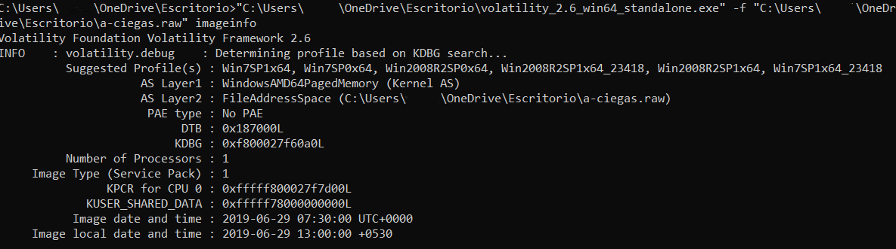 
   
Se ven varios perfiles sugeridos:

- Win7SP1X64  
- Win2008R2SP0x64  
- Win2008R2SP1x64\_23418  
- Win2008R2SP1x64  
- Win7SP1x64\_23418

   
Y se ve también la hora local y del archivo de memoria.  
# PSlist 
Se va a usar el comando pslist. Este comando sirve para ver un listado de las ejecuciones de diferentes programas en el dispositivo. Al ejecutar el comando pslist, se ven varias columnas:  
 

- Offset: Dirección de mem hexadecimal donde se encuentran los datos.  
- Name: Nombre del programa ejecutado.  
- PID: Identificador de proceso único, es un número entero. (Para diferenciar procesos con mismo nombre pero diferente PID).  
- PPID: Identificador de jerarquía de procesos.  
- Thds: Representación de las unidades de ejecución de un proceso.  
- Hnds: Número de manejadores que el proceso ha abierto(Si hay muchos, significa que un proceso está interactuando con varios recursos del sistema.  
- Sess: ID de la sesión del proceso que se está ejecutando.  
- Wow64: Determina si un proceso se está llevando a cabo por medio de 64 bits o 32\.  
- Start: Inicio del proceso (Hora).  
- Exit: Fin del proceso (Hora).

Se van a analizar los perfiles con pslist, que sirve para ver un listado de los procesos que se llevan a cabo en el ordenador.

## Win7SP1X64

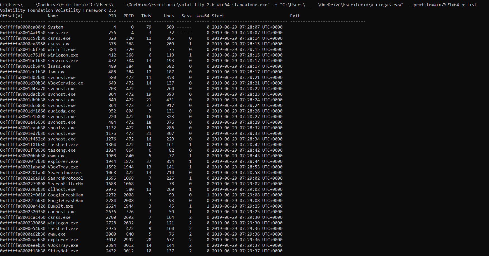 
Buscando en internet se ve que el proceso Dumpit sirve para hacer volcados de memoria del sistema

## Win2008R2SP0x64

 
 

## Win2008R2SP1x64\_2341

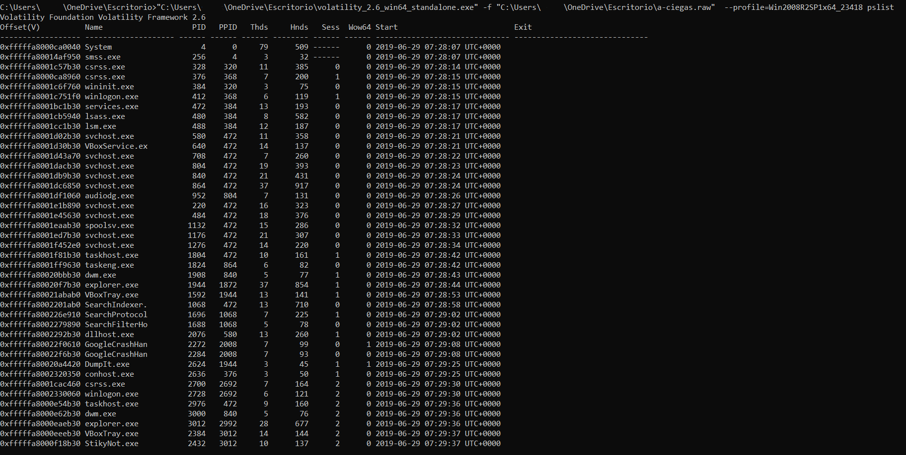

## Win2008R2SP1x64

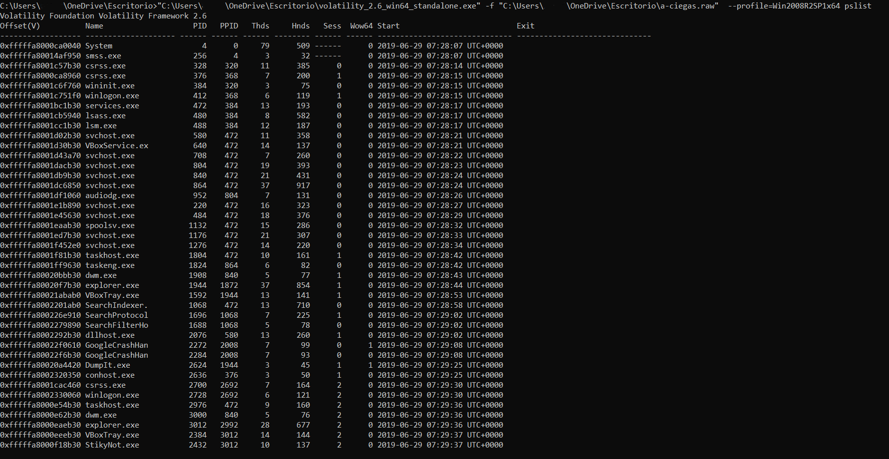  
   
 
## Win7SP1x64\_23418

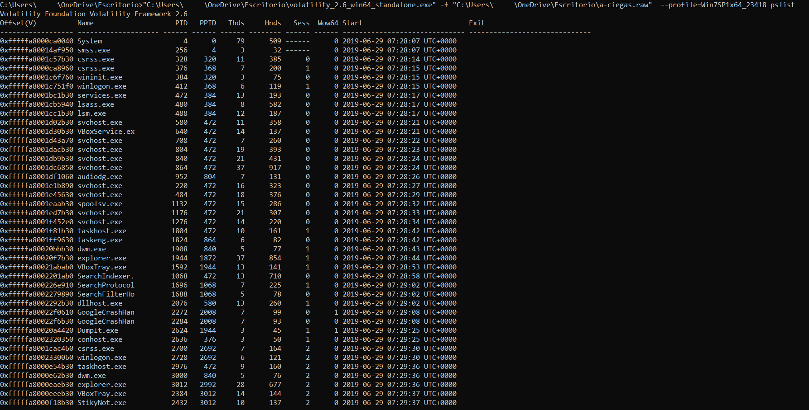
   
En todos los pslist se ven la ejecución de varios programas de manera repetida, ya sean spoolsv.exe(cuyo PID es diferente en cada uno), se ve también el uso de una máquina virtual en todos(VBoxService.ex/VBoxTray.exe), DumpIt.exe(Hasta donde se entiende , se usa para volcados de memoria), …  
En todos los perfiles sugeridos, se ven como hay, en la sección de sess(Inicios de sesión) hay 3:

- 0: Que parece representar procesos fuera de sesión del usuario  
- 1:Una sesión de usuario en la que interactúa con el sistema(En este caso puede deberse de la víctima)  
- 2:Usuario extra, es una sesión desde otro dispositivo(Que podría ser de la víctima) o un acceso no autorizado desde otro dispositivo

En general, los procesos que se han llevado a cabo en esta “sesión” son:

- StickyNot.exe  
- VBoxTray.exe  
- explorer.exe  
- dwm.exe  
- taskhost.exe  
- winlogon.exe  
- csrss.exe

Un punto importante a tener en cuenta es que la víctima, siempre entra a la misma hora , que se entiende que es a las 8:30, y todos los procesos llevados a cabo, se ejecutan algo más que una hora antes, a las 7:28 exactamente.  Por lo que se puede deducir que algunos procesos son automaticos del ordenador o de la red y que otros son del atacante  
   
   
# Pstree
Ahora se va a usar pstree:

## Win7SP1X64

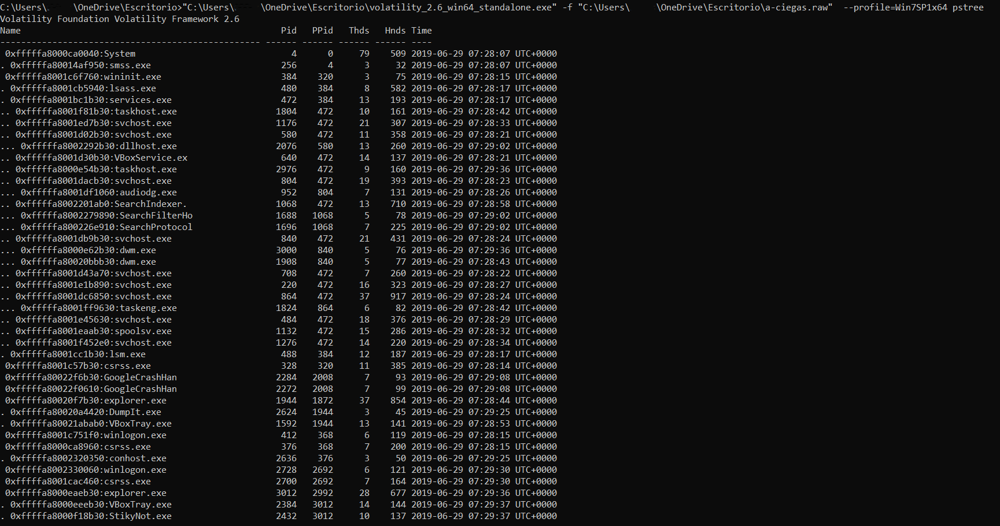 
 

## Win2008R2SP0x64

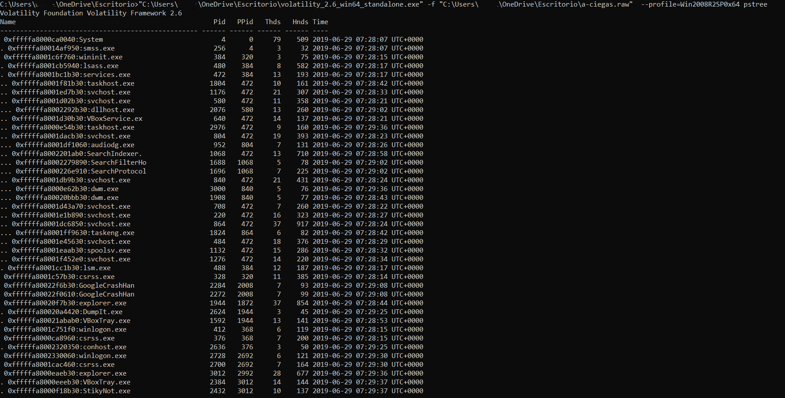

 

## Win2008R2SP1x64\_23418

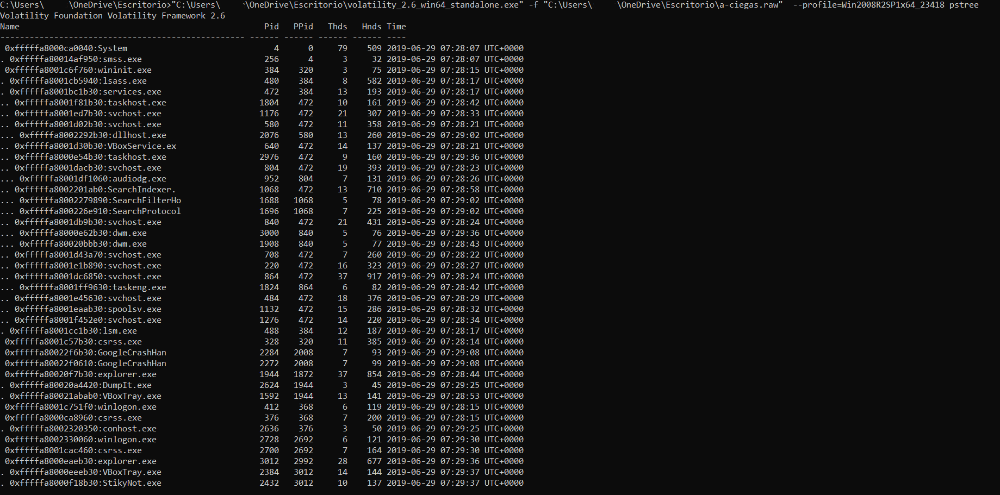 
 

## Win2008R2SP1x64

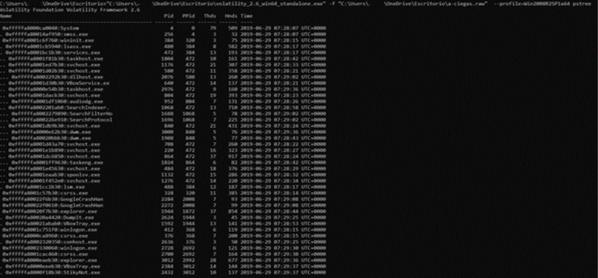
 

## Win7SP1x64\_23418

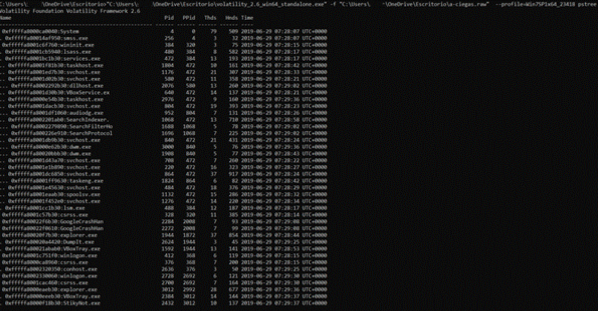 
   
   
# Netscan    
Se va a usar el comando netscan, ya si la victima no le ha dado su ordenador a nadie, lo más probable es que se hayan conectado por medio de la red.  
   
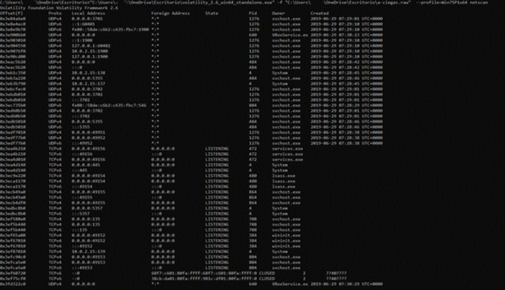
   
Se ve como entre las 7:28 y las 7:30, se lleva a cabo una conexión, en la que se ejecuta principalmente un proceso llamado scvhost.exe , que se ejecuta varias veces ,y a veces con un Pid diferente  , y un proceso que parece ejecutarse relativamente más tarde VBoxService.exe que los atacantes pueden usar virtualbox para “ocultar” sus pasos.  
Algo a recalcar es que el PID, es un identificador de los procesos, esto quiere decir que aunque haya procesos que se llamen igual , el identificador los diferencia. La víctima no parece estar usando virtual box, ya que a esas horas no se conecta, por lo que refuerza la teoría de que el atacante la esté usando para acceder al sistema.  
Se ven algunas direcciones IP que podrían ser relevantes en los procesos de svchost.exe o similares , como las direcciones privadas 10.2.15:137 /138 o la 127.0.0.1:160402  
Se va a ejecutar el comando malfind para comprobar si existe código malintencionado o alterado de alguna manera que ayude a identificar si se ha atacado al dispositivo.Hasta donde se puede llegar a entender, se han alterado o el programa sospecha de varios procesos:

- explorer.exe Pid: 1944  
- SearchFilterHo Pid: 1688  
- dllhost.exe Pid: 2076  
- StikyNot.exe Pid: 2432

# Autocrítica

- No debería de haber analizado todos los perfiles que me salieron en un primer lugar  
- Debería haber administrado el tiempo mejor  
- Debería haberme informado mejor de comandos de volatility para poder llevar a cabo un mejor análisis

[GitHub: Ch4mbi](https://github.com/Ch4mbi)
